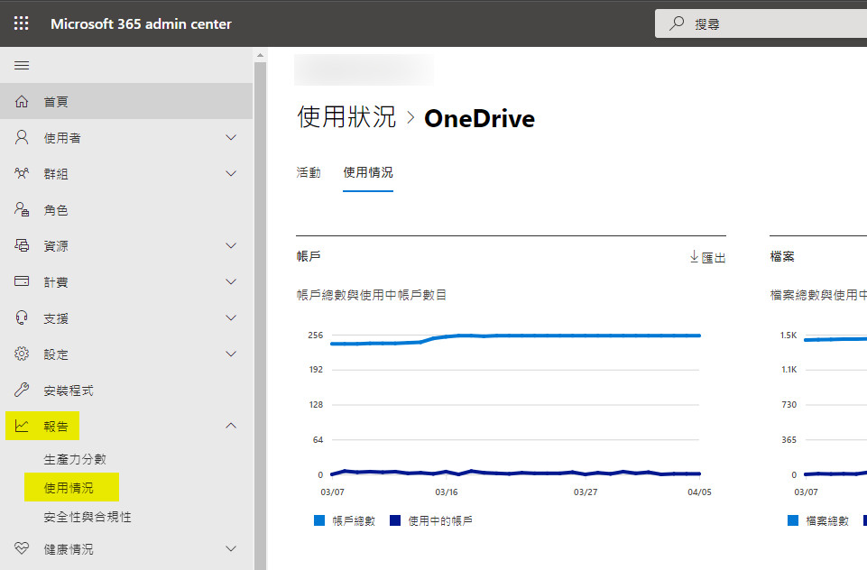
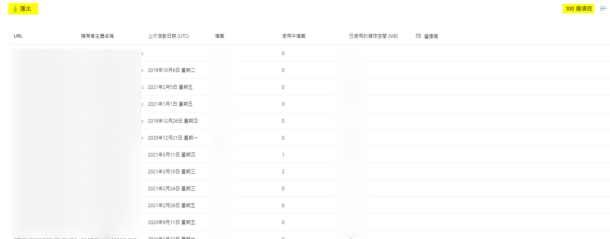
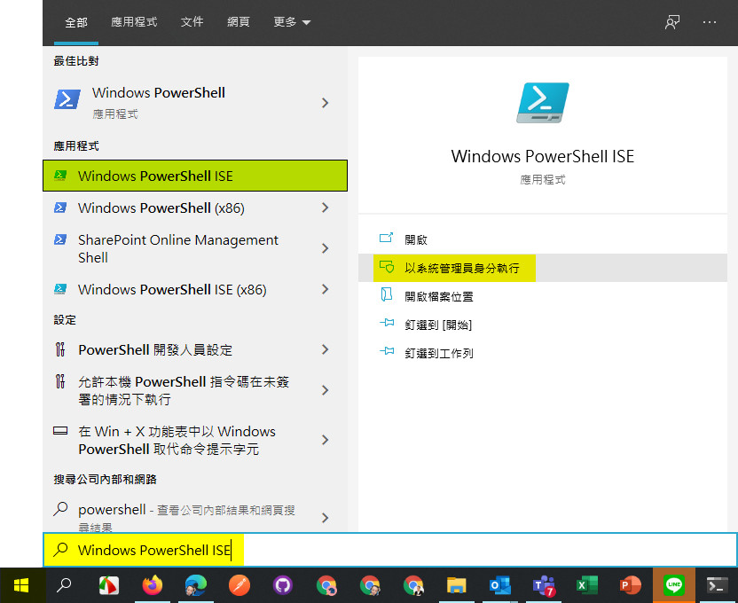
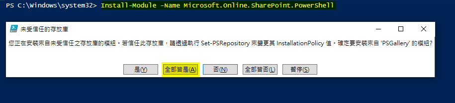

# 如何關閉OneDrive在Client端的文件夾存取權

## 調閱所有使用者的OneDrive URL

※若已有明確需要關閉的使用者清單或單一使用者，請跳過這個步驟，並繼續往下閱讀。 <br>

Step 1. 請以全域管理者或SharePoint 管理員身分登入 [https://admin.microsoft.com](https://admin.microsoft.com)。 <br>

Step 2. 在左方導覽列中選擇「報告 > 使用情況」。<br>

 <br>

Step 3. 進入使用情況後，請往下捲動至 OneDrive 檔案的位置，並點選「檢視更多」。<br>

 <br>

Step 3. 確認清單後，請點選上方的「匯出」連結，以將所有的OneDrive URL匯出 (你可能需要往下捲動至最底端選擇「檢視更多」)。 <br>

 <br>

## 透過 PowerShell 關閉Client端文件夾存取權

### 關閉單一使用者

Step 1. 透過系統管理員身分開啟PowerShell ISE

 <br>

Step 2. 安裝 SharePoint Module，請輸入以下指令 (執行過程需要一段時間安裝)，並在過程中點選 **全部皆是(A)** <br>

若執行完成跳出橘色文字之警示訊息，可忽略。

```Install-Module -Name Microsoft.Online.SharePoint.PowerShell```

 <br>

Step 3. 連結 SharePoint Admin Center 請輸入以下指令 <br>

```Connect-SPOService -Url https://xxx-admin.sharepoint.com``` <br>

其中 xxx 位置為您的 SharePoint Admin Center 網址，此網址可於 Microsoft 365 Admin Center中察看，<br>

查看位置為：**Microsoft 365 Admin Center > 系統管理中心 > SharePoint** <br>

進入後之URL即為 SharePoint Admin Center <br>

輸入指令後，<br>

### 關閉多位使用者
